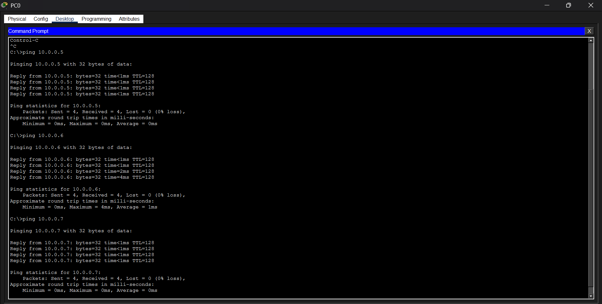
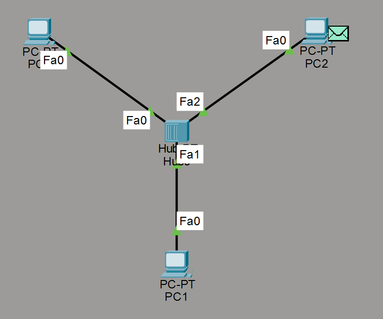
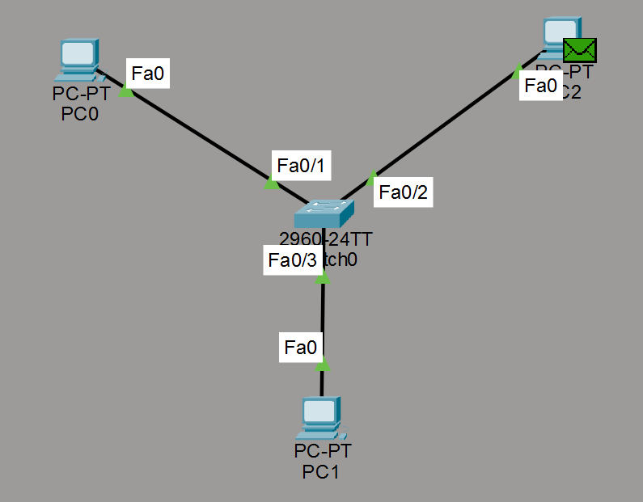

# Relatório Técnico: Experimento de Camada Física e Enlace (Hub vs. Switch)

## Introdução
Este relatório documenta a análise da propagação de sinais e PDUs em dois cenários distintos no Cisco Packet Tracer: uma rede baseada em Hub e outra baseada em Switch, visando validar o entendimento sobre meio compartilhado e domínios de colisão.

---

## PARTE 1: Rede com HUB e Análise de Propagação

### Configuração e Conectividade
A topologia foi montada com 3 PCs conectados a um Hub central. O primeiro passo foi validar a comunicação básica entre todos os nós através do comando `ping`.

*Figura 1: Evidência de conectividade IP (ICMP) bem-sucedida entre 10.0.0.5, 10.0.0.6 e 10.0.0.7.*

### Observações da Simulação (Simple PDU)
Ao enviar uma Simple PDU do **PC0 (10.0.0.5)** para o **PC2 (10.0.0.7)**, observa-se o comportamento típico de um repetidor de Camada 1:

*Figura 2: O Hub replicando o sinal para todas as portas (PC1 e PC2). Note o descarte no PC1.*

1. O sinal elétrico chega ao Hub.
2. O Hub replica o sinal para **todas** as outras portas ativas (PC1 e PC2).
3. O PC1 recebe o quadro, verifica que o MAC de destino não é o seu e o descarta (marcado com um "X" vermelho).
4. O PC2 recebe, processa e responde.

### Respostas Técnicas

**a) Por que todos os nós recebem o quadro inicialmente dentro de um hub?**
O Hub opera exclusivamente na **Camada 1 (Física)** do modelo OSI. Ele não possui inteligência para ler endereços MAC ou gerenciar tabelas. Tecnicamente, ele funciona como um repetidor multiportas: qualquer sinal elétrico (bits) que entra por uma porta é eletricamente regenerado e transmitido para todas as outras, sem qualquer filtragem ou decisão de encaminhamento.

**b) Explique como isso se relaciona ao conceito de meio compartilhado com desempenho real na camada física.**
O Hub cria um único **domínio de colisão**. Como o meio físico é compartilhado, apenas um dispositivo pode transmitir por vez com sucesso. Se dois dispositivos transmitirem simultaneamente, ocorre uma colisão de sinais elétricos, tornando os dados ileis. Em termos de desempenho real, quanto mais nós houver no Hub, maior a probabilidade de colisões e menor a largura de banda efetiva disponível para cada dispositivo (Half-Duplex).

---

## PARTE 2: Rede com SWITCH e Comparação Física

### Configuração
O Hub foi substituído por um Switch Cisco 2960. Após a estabilização das portas (indicadas pelos LEDs verdes no simulador), o teste de PDU foi repetido.

### Observações da Simulação
Ao enviar a mesma PDU do **PC0** para o **PC2**, o comportamento muda drasticamente devido à inteligência de Camada 2:

*Figura 3: O Switch encaminhando o sinal apenas para a porta de destino (PC2).*

1. O sinal chega ao Switch.
2. O Switch consulta sua tabela MAC (CAM Table) e identifica que o PC2 está na porta correspondente.
3. O quadro é encaminhado **unicamente** para a porta onde o PC2 está conectado.
4. O PC1 não recebe nenhum sinal ou PDU durante esta transação, mantendo o canal livre.

### Respostas Técnicas

**a) Compare o fluxo do sinal elétrico no switch versus hub.**
No **Hub**, o fluxo é de difusão (broadcast) física obrigatória; o sinal é "ecoado" para todos. No **Switch**, o fluxo é direcionado (unicast). O Switch atua na **Camada 2 (Enlace)**, sendo capaz de segmentar a rede eletricamente através de micro-segmentação: ele cria um caminho temporário e dedicado entre a porta de origem e a de destino.

**b) Por que agora a PDU não é propagada para todos os nós da mesma forma?**
Graças ao processo de **aprendizado de endereços MAC**. O Switch mapeia qual endereço físico está em cada porta. Quando um quadro chega, o Switch lê o endereço MAC de destino no cabeçalho de enlace e o envia apenas para a porta correspondente, evitando o tráfego desnecessário nos demais segmentos.

**c) O switch elimina o meio físico compartilhado? Justifique tecnicamente.**
Sim, em termos de domínio de colisão. O Switch elimina o meio compartilhado clássico ao tratar cada porta como um **domínio de colisão individual**. Isso permite a operação em **Full-Duplex**, onde os dispositivos podem transmitir e receber simultaneamente sem colisões, pois não há disputa pelo mesmo caminho elétrico entre múltiplos nós fora do par ponto-a-ponto entre o PC e o Switch.

---
*Relatório gerado com base nos cenários `hub.pkt` e `switch.pkt`.*
